# IDEA安装数据库插件

使用IDEA社区版安装数据库插件。

# 1、安装

在**Marketplace**中搜索**DB**即可看到**Database Navigator**插件，选择安装即可。

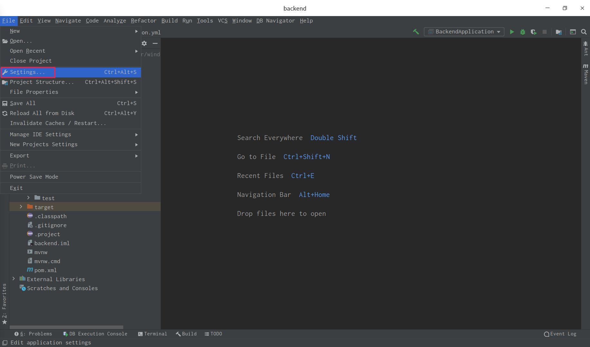

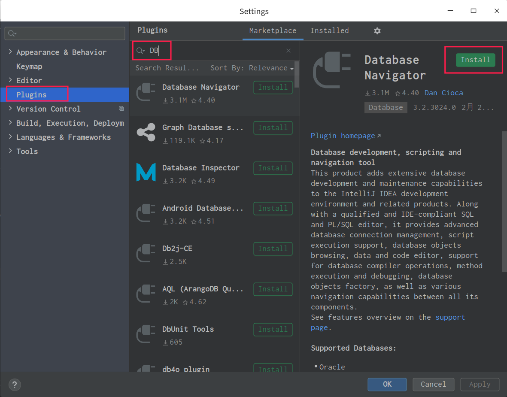

重启生效：

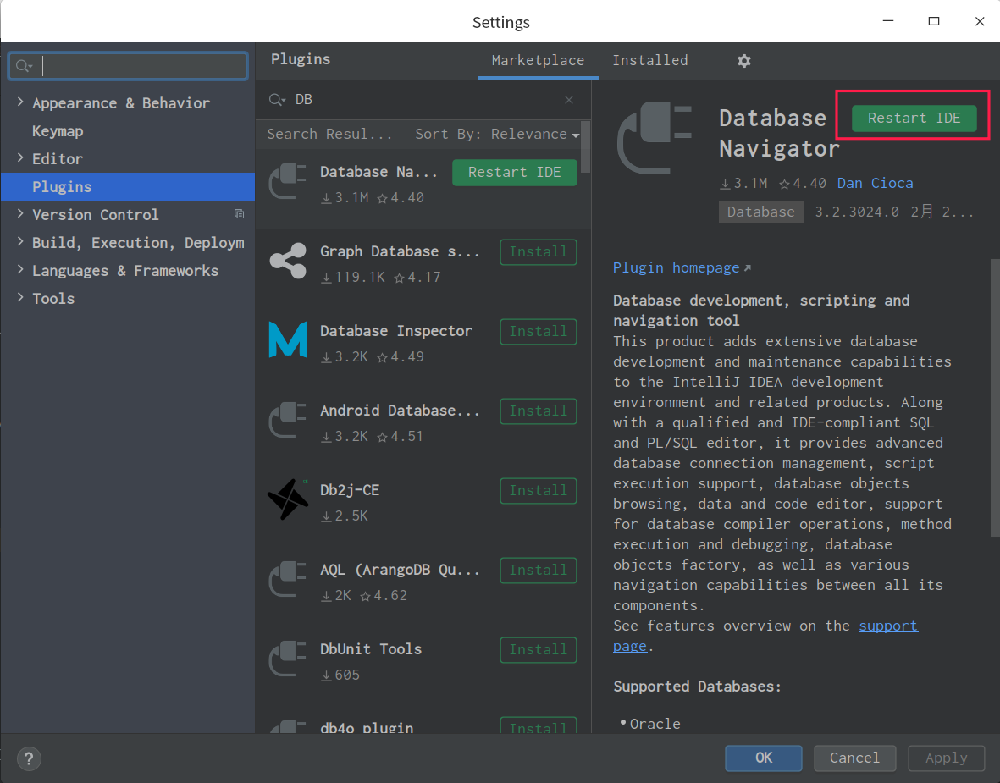

# 2、禁用与卸载

在**Installed**中可以选择对插件进行禁用或卸载。

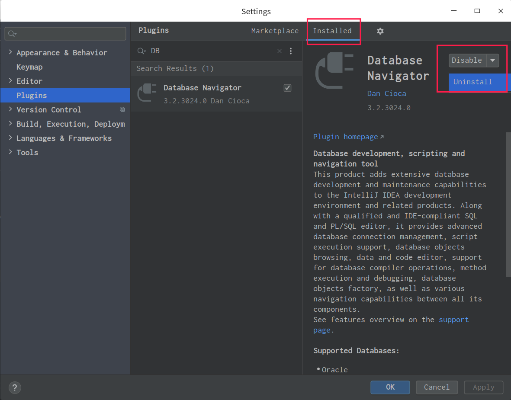

# 3、展示与使用

## **3.1、展示**

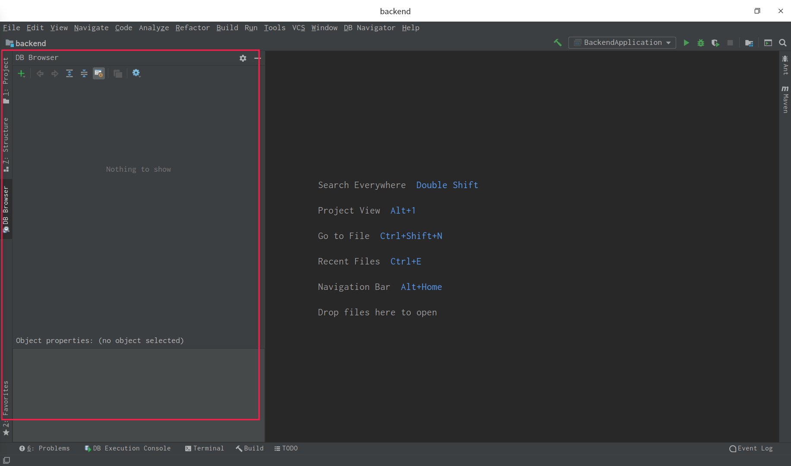

切换展示位置：

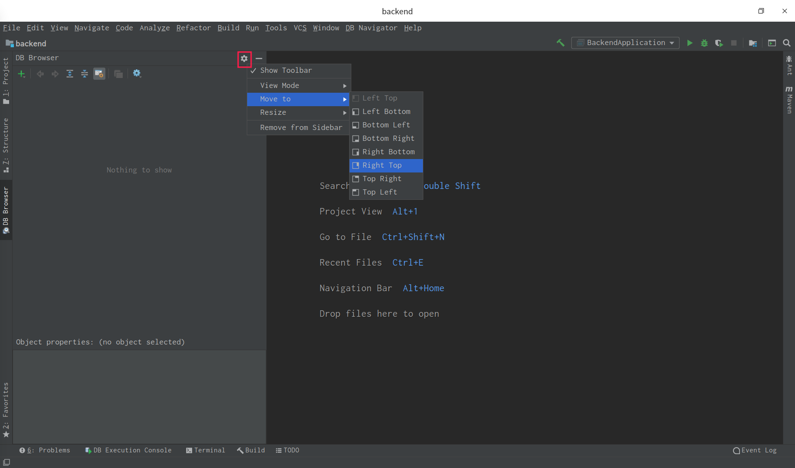

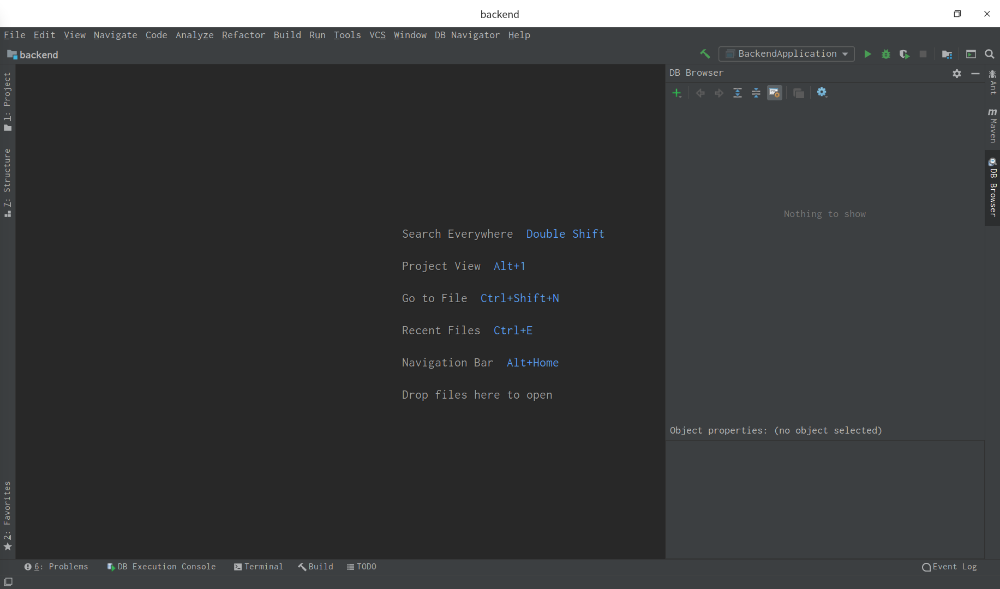

## 3.2、使用

配置数据库链接：

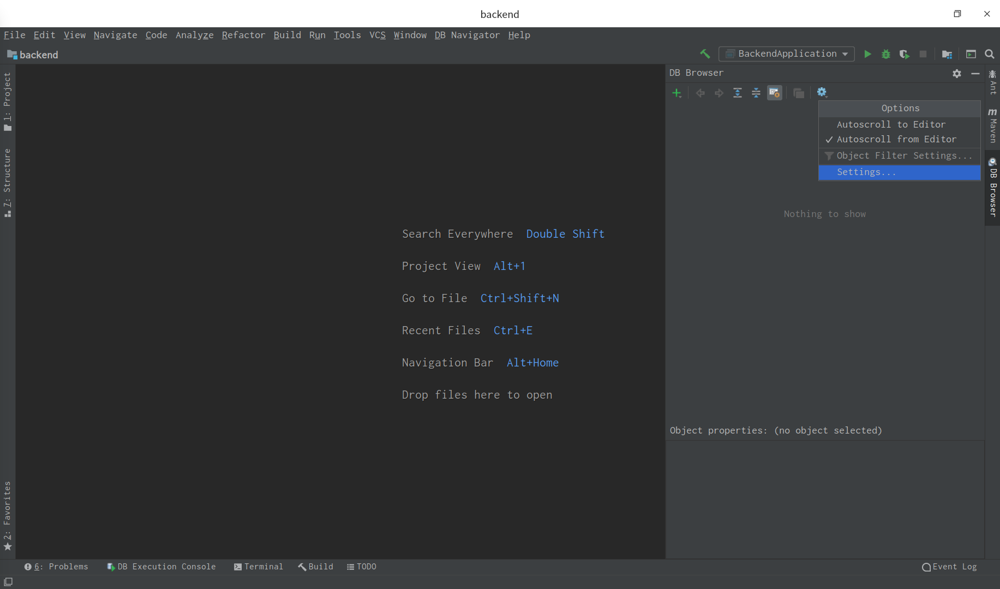

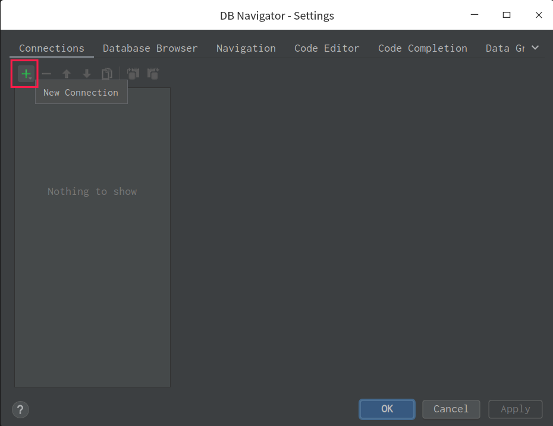

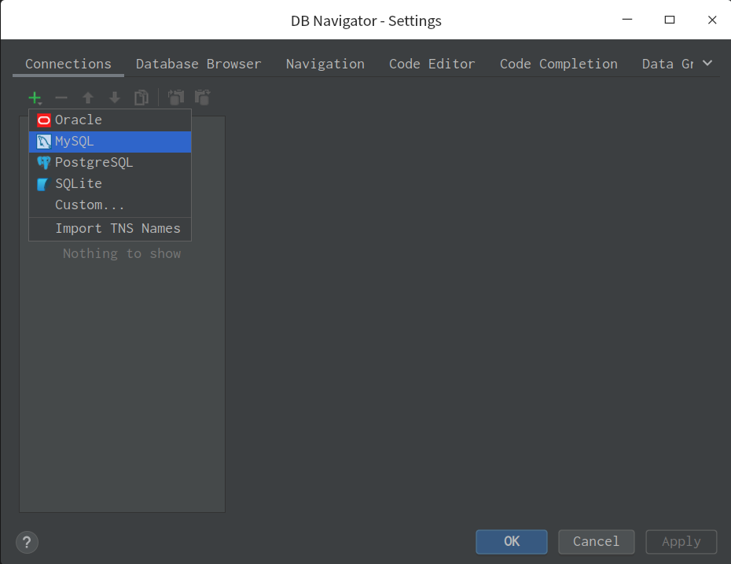

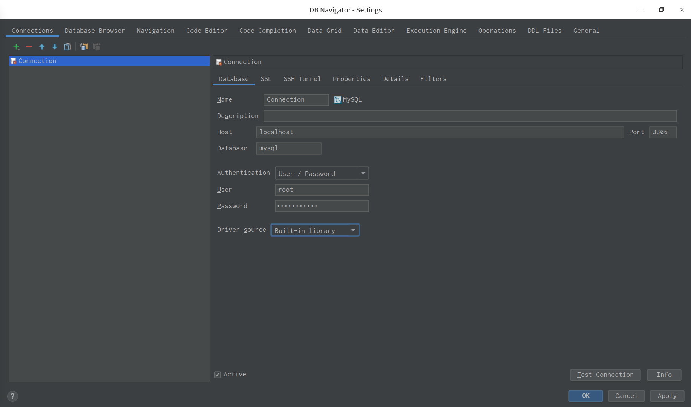

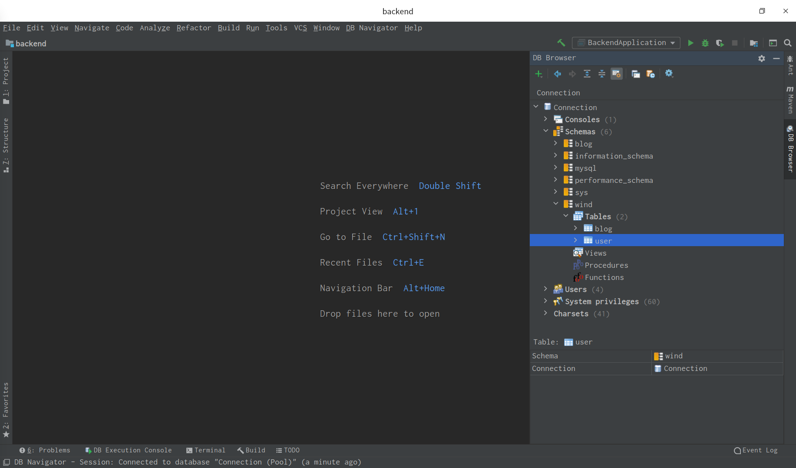

查询测试:

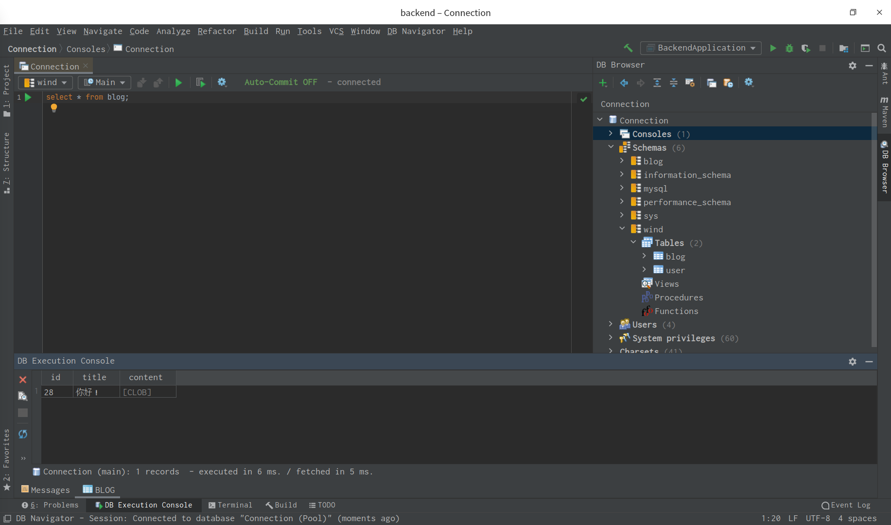
