# Deepin配置Maven

# 一、下载解压

## 1.1、下载

[http://maven.apache.org/download.cgi](https://maven.apache.org/download.cgi)

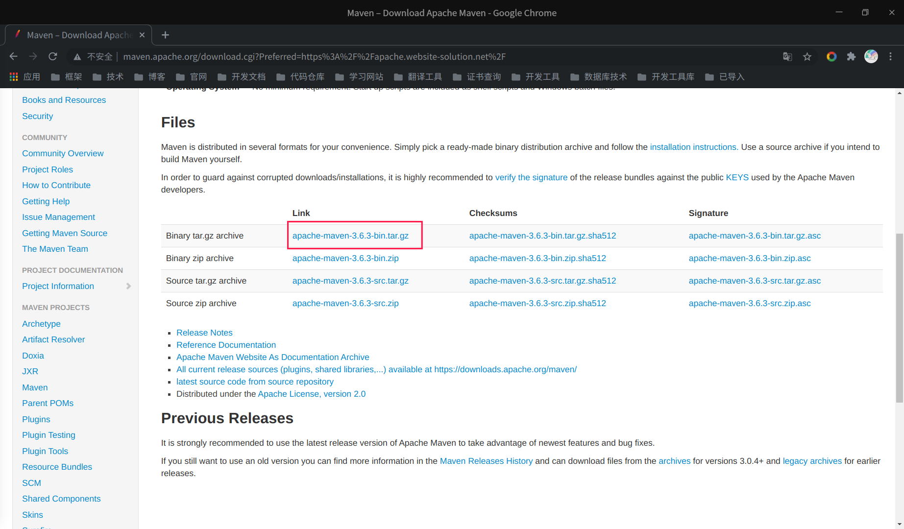

## 1.2、解压

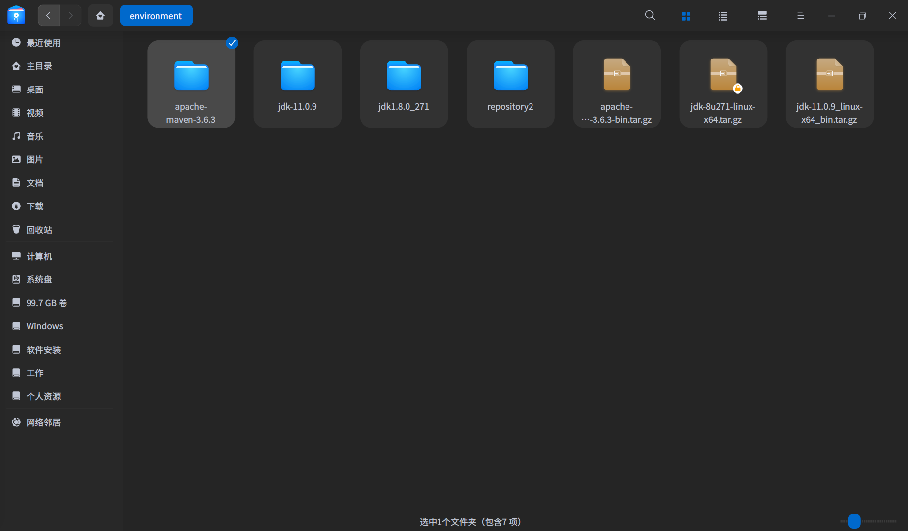

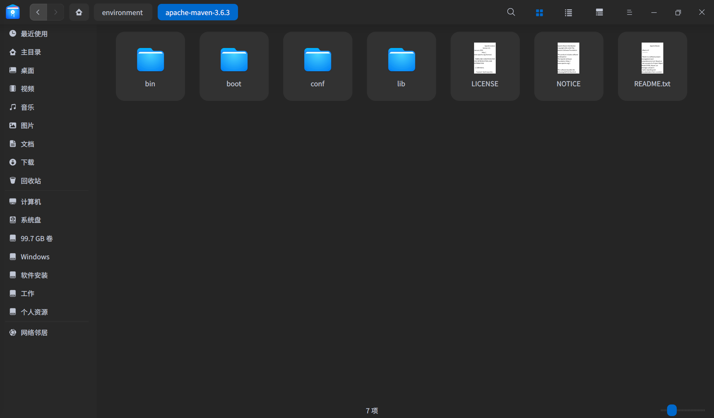

# 二、修改settings.xml

## 2.1、准备本地仓库

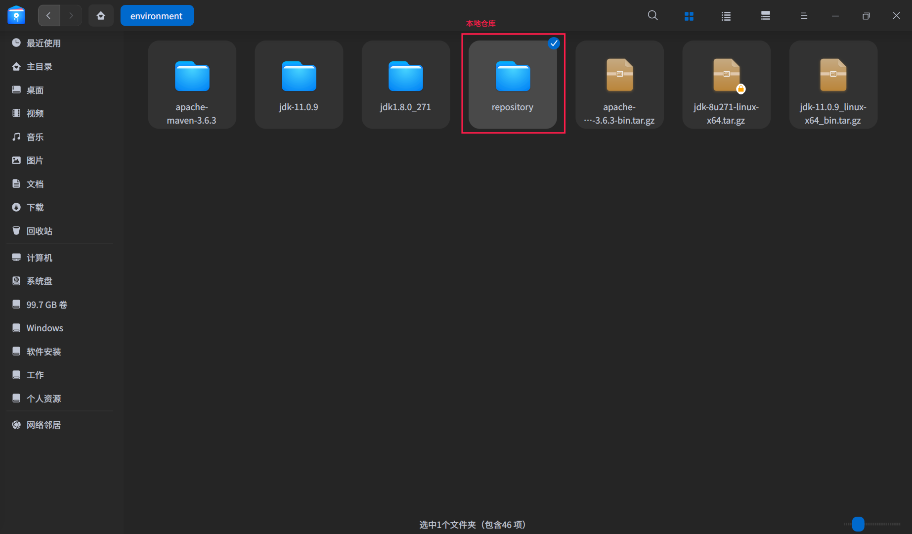

## 2.2、修改settings.xml

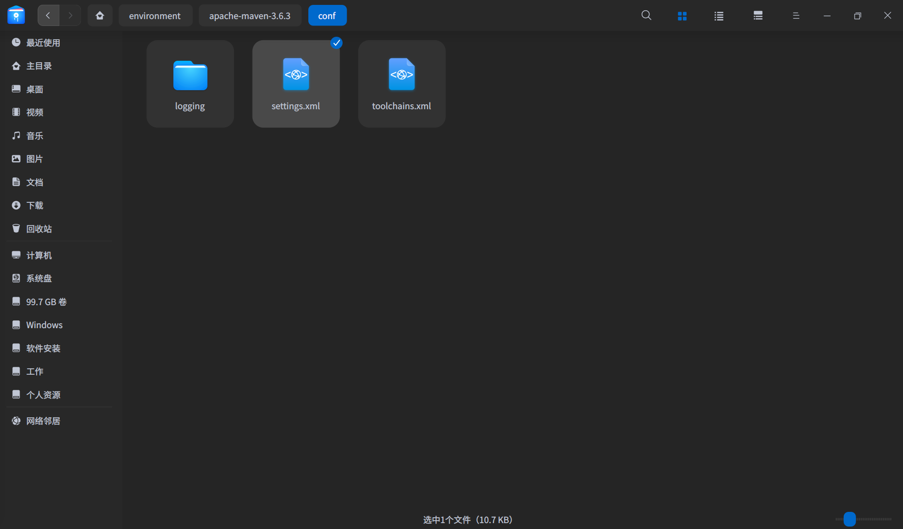

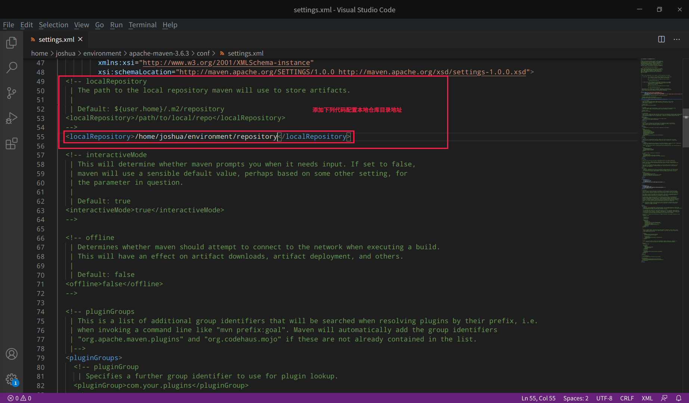

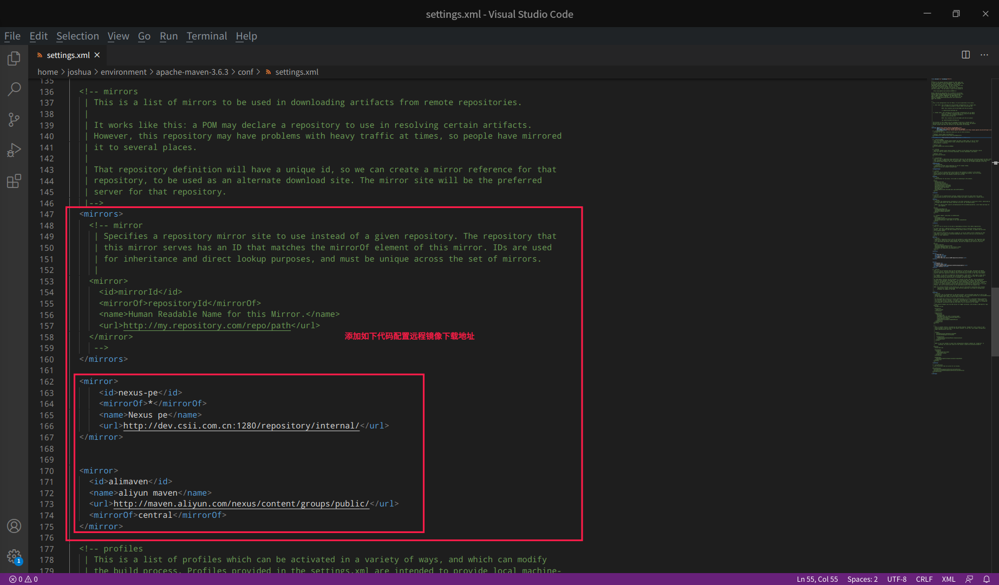

```xml
 <mirror>
      <id>nexus-pe</id>
      <mirrorOf>*</mirrorOf>
      <name>Nexus pe</name>
      <url>http://dev.csii.com.cn:1280/repository/internal/</url>
  </mirror>

  
  <mirror>
    <id>alimaven</id>
    <name>aliyun maven</name>
    <url>http://maven.aliyun.com/nexus/content/groups/public/</url>
    <mirrorOf>central</mirrorOf>        
  </mirror>
```

# 三、配置Maven

## 3.1、使用vim编辑profile文件

```vim
sudo /etc/profile
```

## 3.2、配置maven环境

```vim
export MAVEN_HOME=（Maven安装目录）

export PATH=$MAVEN_HOME/bin:$PATH
```

3.2.1编辑

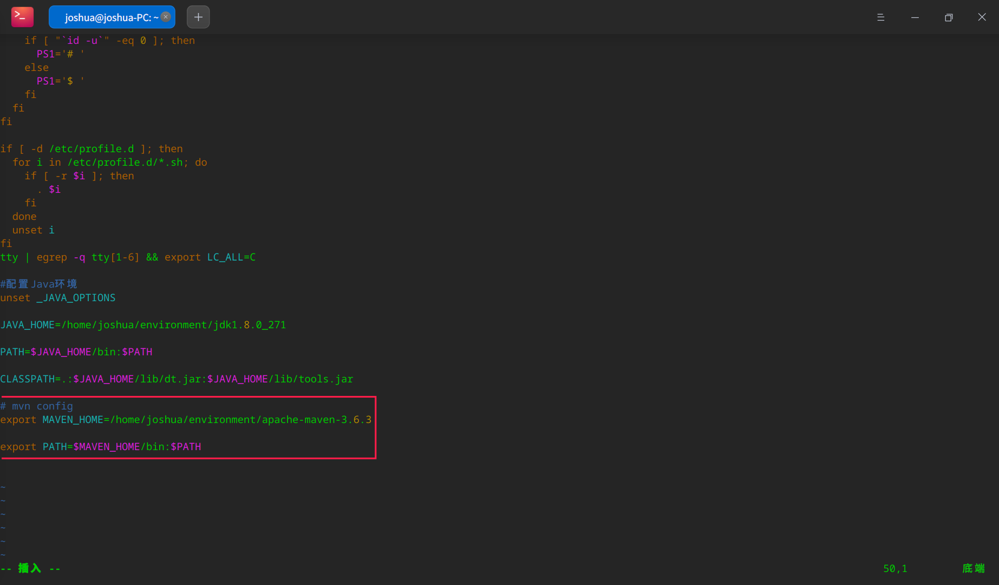

3.2.2、保存退出

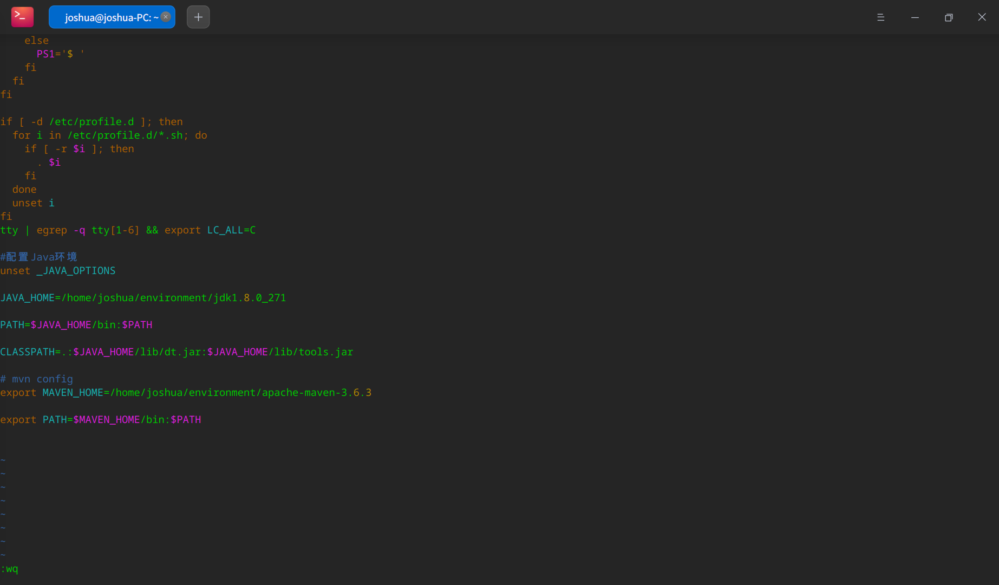

## 3.3、编译profile文件

```vim
source /etc/profile
```

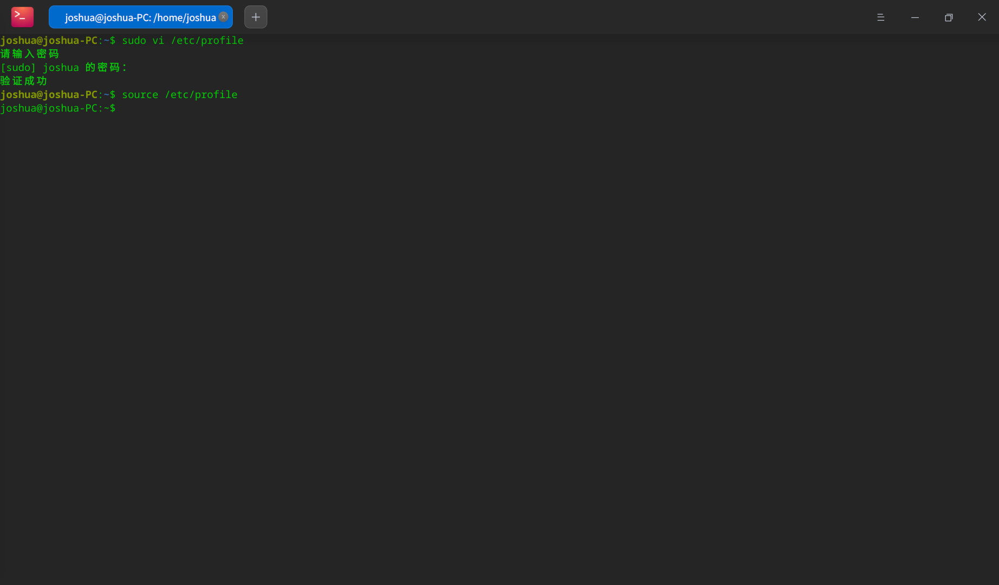

## 3.4、查看配置情况

```vim
mvn -v
```

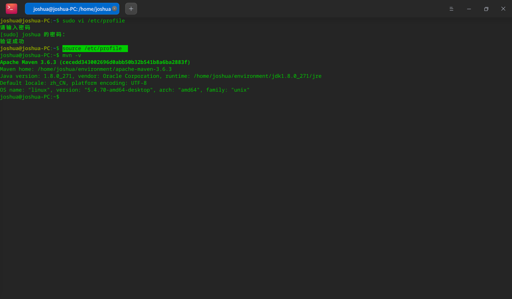
