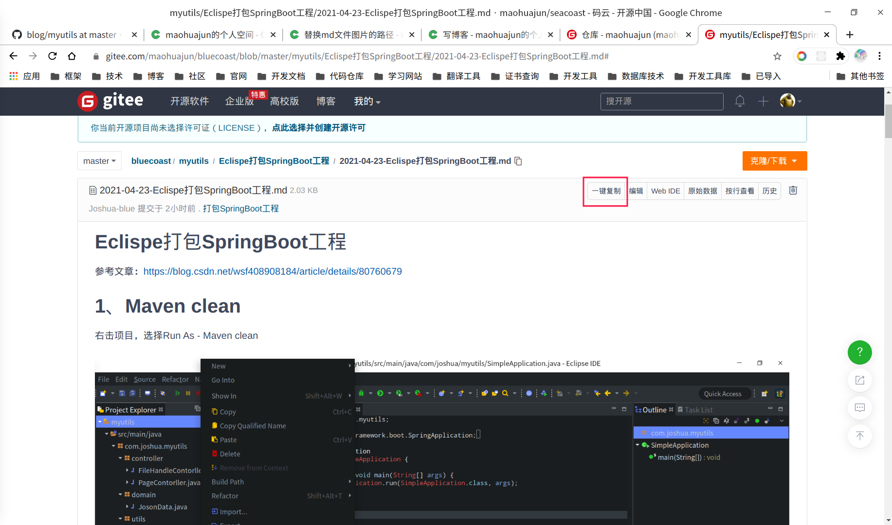
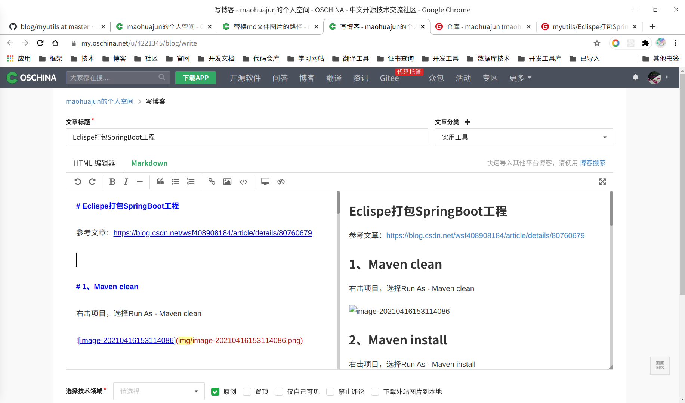
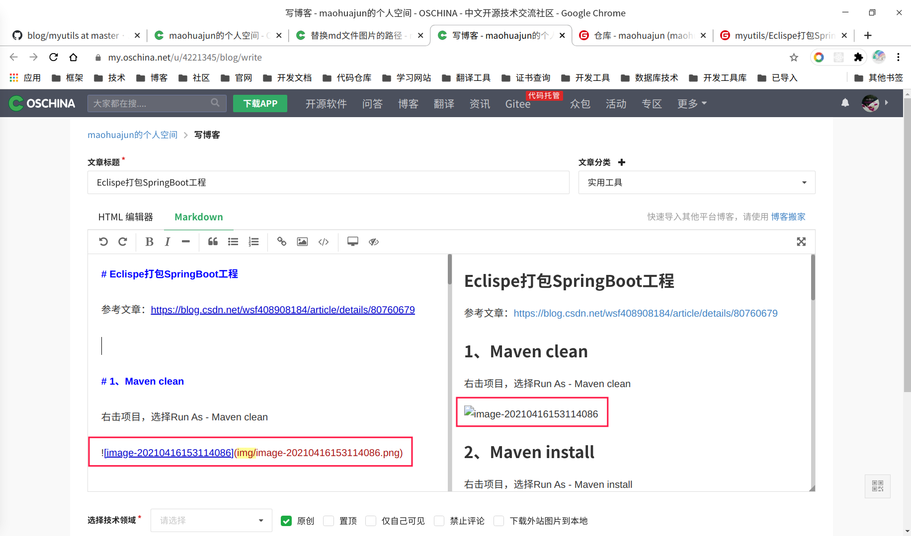
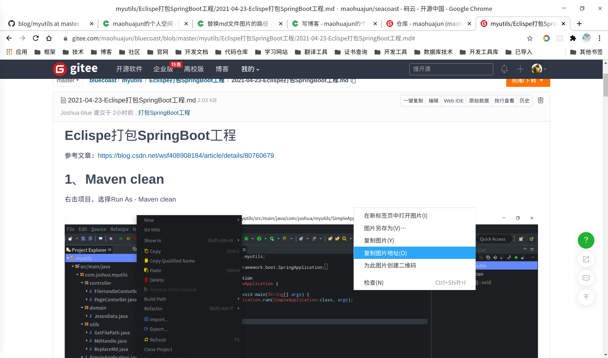
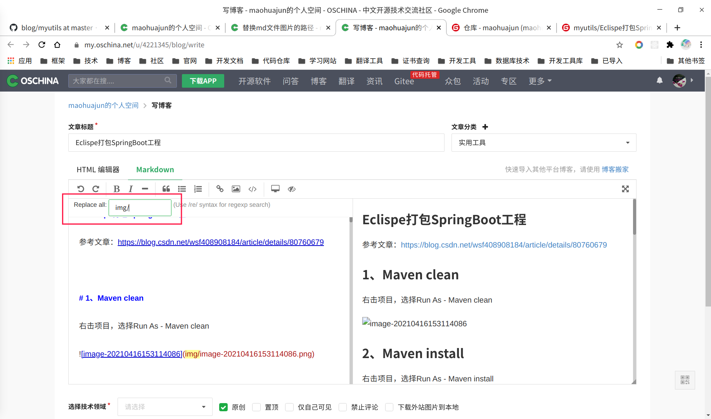
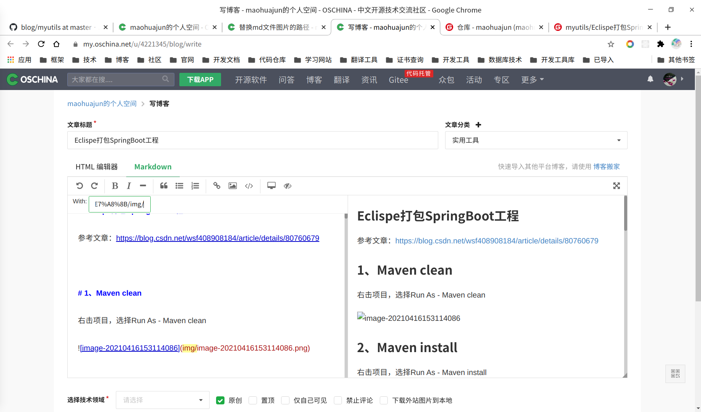
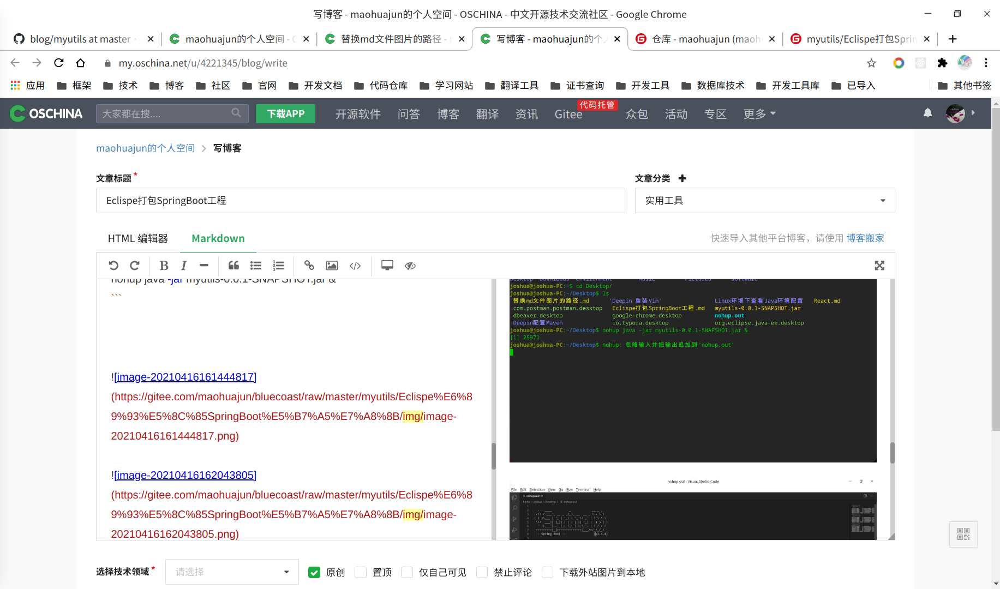

# 在线写Md博客文档时文本替换快捷键Ctrl+Shift+r

以开源中国为例，将gitee上托管的博客资源发表到开源中国上：

复制md文本内容：

粘贴到开源中国：

引用的图片路径不对不能正常显示：

复制、替换图片路径图片路径：

复制图片地址：

快捷键 `Ctrl + Shift + r` 输入需要替换的内容：

回车后粘贴要替换的图片地址，稍作修改：

替换后图片可以正常显示：

保存发表文章即可。

