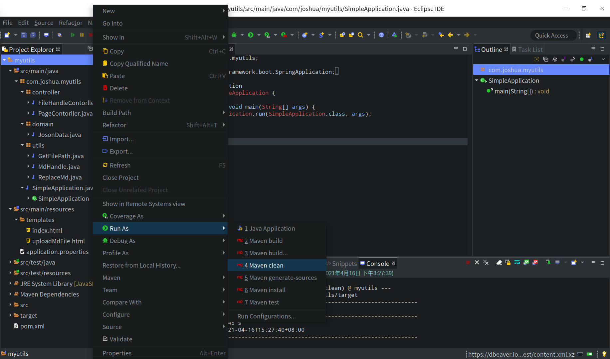
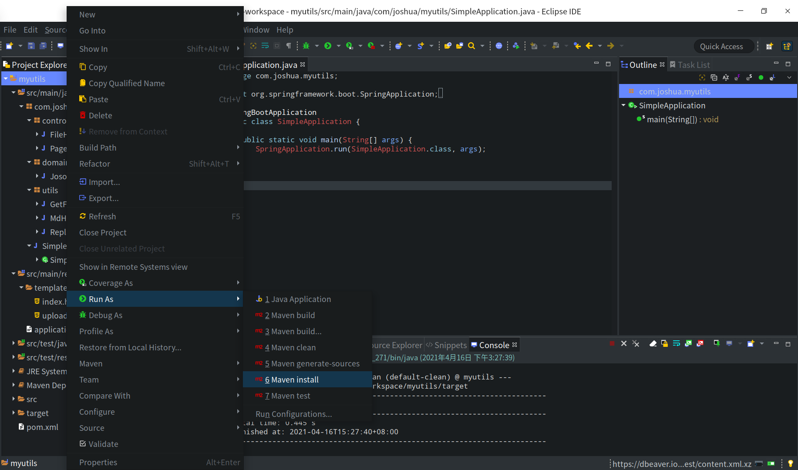
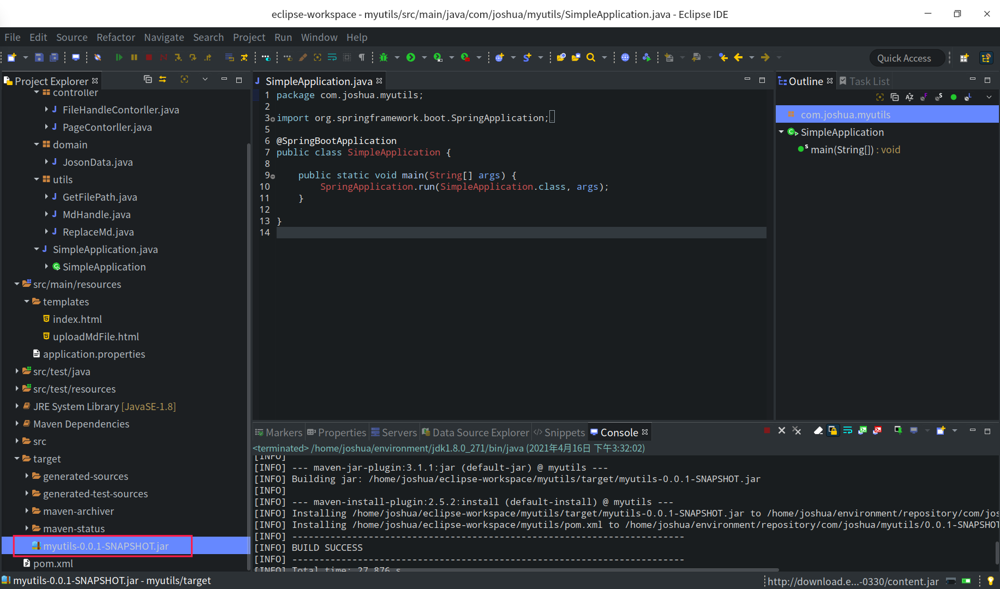
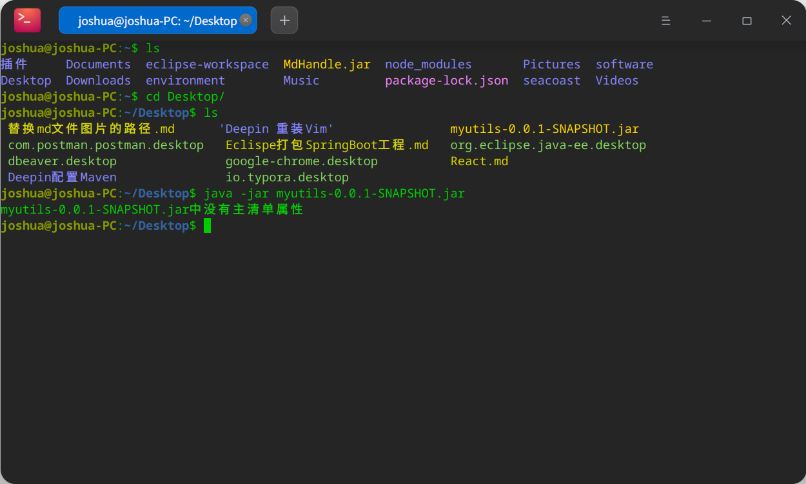
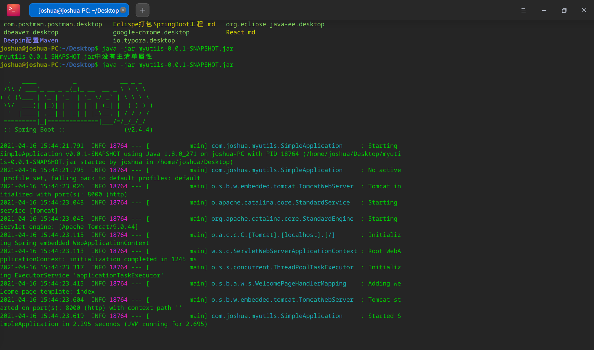
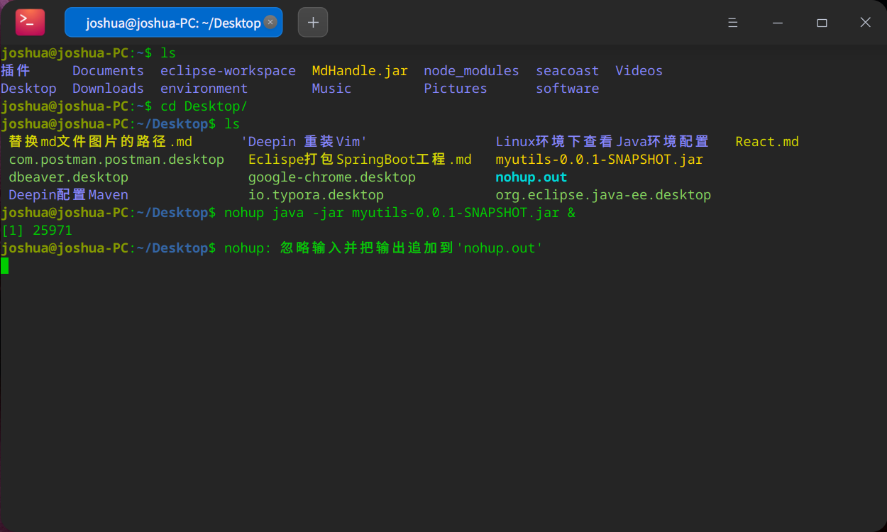
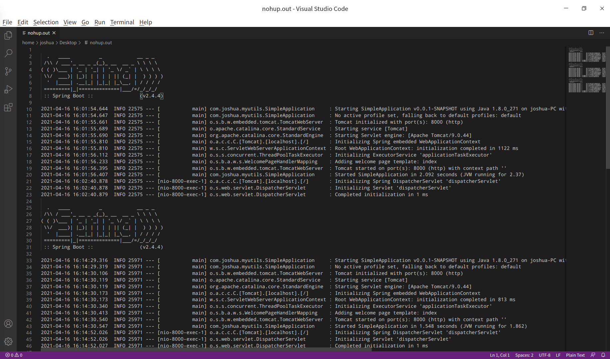
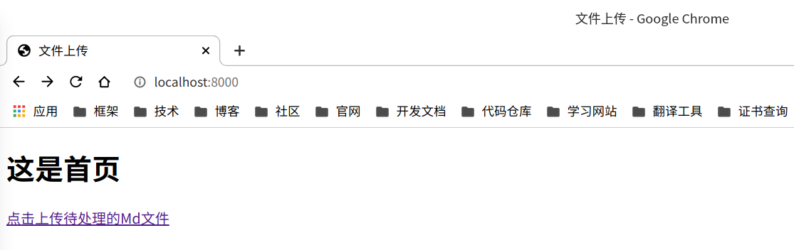
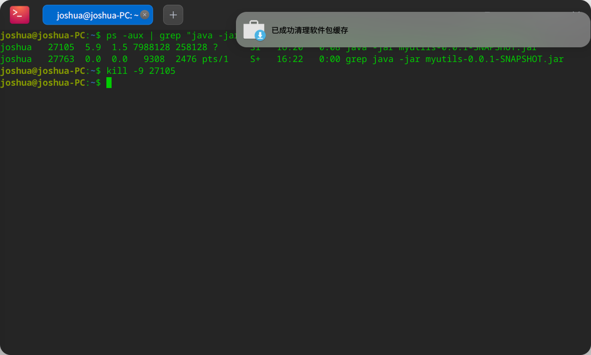
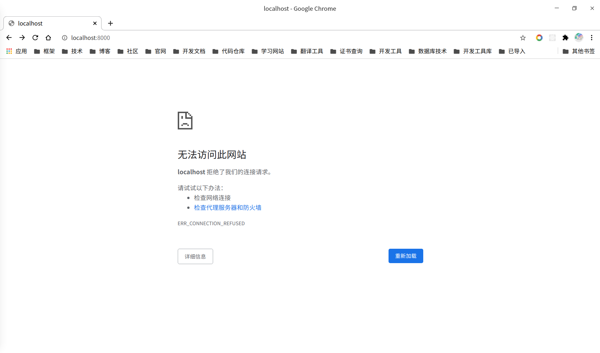

# Eclispe打包SpringBoot工程

参考文章：https://blog.csdn.net/wsf408908184/article/details/80760679


# 1、Maven clean

右击项目，选择Run As - Maven clean




# 2、Maven install

右击项目，选择Run As - Maven install




# 3、运行测试

打包成功后，会在项目的target文件夹下生成jar包：




## 3.1、运行不挂起

​		可以将打包好的jar包使用运行`java -jar` 指令运行jar包，也可以部署到服务器上运行，此方式Ctrl+C或关闭终端窗口后服务会停止：

复制到桌面后打开终端运行：



​		运行jar包后显示没有没有主清单属性，需要在`pom.xml`文件添加`spring-boot-maven-plugin`打包插件，保存后新打包：

```xml
	<build>
		<plugins>
			<plugin>
				<groupId>org.springframework.boot</groupId>
				<artifactId>spring-boot-maven-plugin</artifactId>
			</plugin>
		</plugins>
	</build>
```





## 3.2、运行并挂起

​		**nohup** 英文全称 no hang up（不挂起），用于在系统后台不挂断地运行命令，退出终端不会影响程序的运行。`nohup`指令参考：https://www.runoob.com/linux/linux-comm-nohup.html


用nohup指令启动：

```shell
nohup java -jar myutils-0.0.1-SNAPSHOT.jar &
```







服务已启动，可以访问端口：



(关闭终端依然可以访问服务)


找到服务进程，关闭服务：

```shell
ps -aux | grep "java -jar myutils-0.0.1-SNAPSHOT.jar"
```

```shell
kill -9 27105
```




