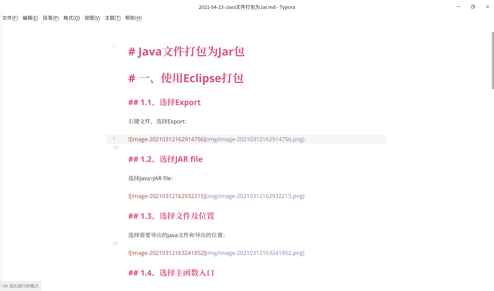
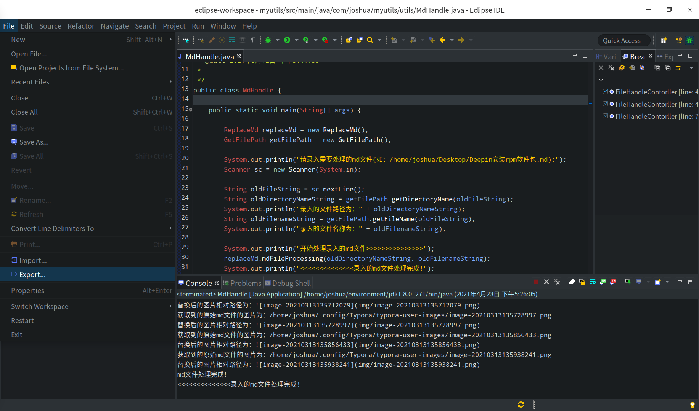
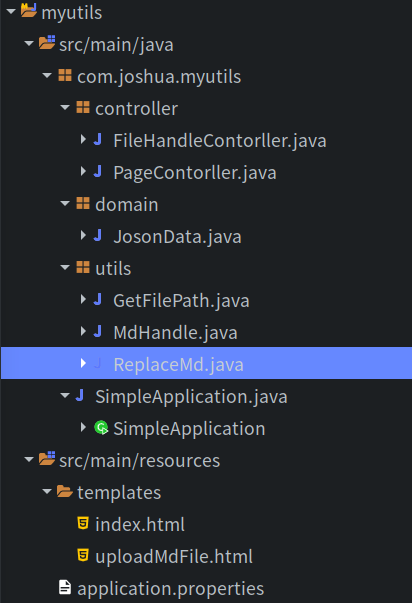
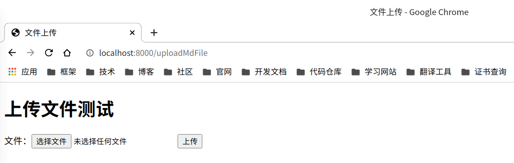
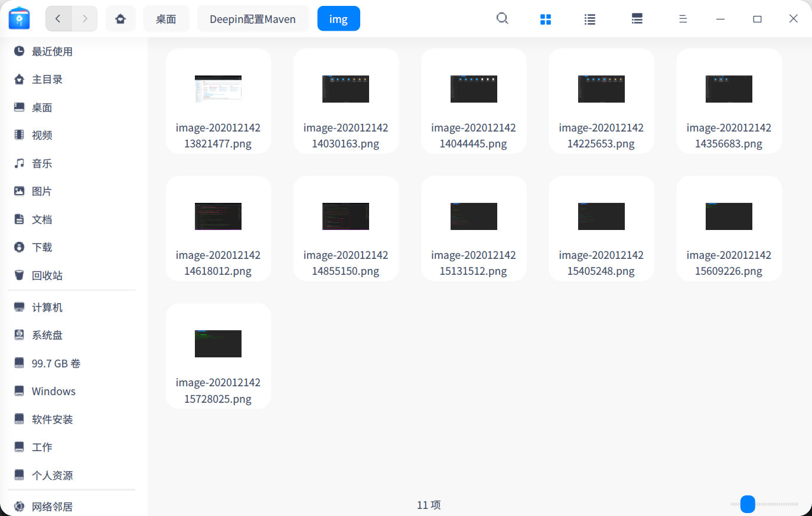
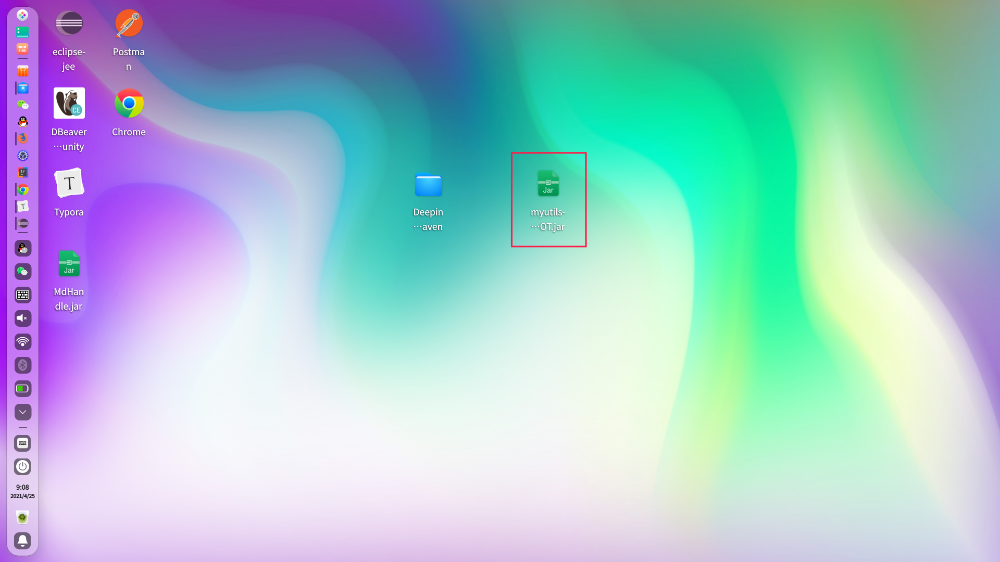

# 替换md文件图片的路径

# 一、问题描述

​		作为一个菜鸟程序员，在使用markdown写学习笔记时，截图粘贴到md文档中时引用的图片是绝对路径，图片存储的位置也许并不是我们想要的：


我们常常需要替换成相对路径并且将图片放到相对路径，以便更好的整理上传到自己的代码仓库：


简单来说，我们需要把md文档中的引用的图片找到，并取出放到建立的相对路径下，从而通过相对路径引用。


# 二、解决过程

使用Java的文件操作流来处理，核心代码如下：

```java
package com.joshua.myutils.utils;

import java.io.*;
import java.util.Date;
import java.text.SimpleDateFormat;

/**
 * 
 * @ClassName: ReplaceMd
 * @Description: TODO(替换md文件中的图片路径，并将原始md文件中引用到图片拷贝到md文件所在文件夹img目录中)
 * @author joshua
 * @date 2021年3月12日 下午2:48:45
 *
 */
public class ReplaceMd {

	GetFilePath getFilePath = new GetFilePath();

	public void mdFileProcessing(String directoryName, String filename) {

		File imageCatalog = new File(directoryName + "/img");
		imageCatalog.mkdir(); // 创建用于存储图片的目录
		System.out.println("创建存储图片的目录为：" + imageCatalog);
		File odlfile = new File(directoryName, filename); // 需要处理到md文件
		SimpleDateFormat df = new SimpleDateFormat("yyyy-MM-dd");// 设置日期格式
		File newfile = new File(directoryName, df.format(new Date()) + "-" + filename); // 需要处理到md文件
		System.out.println("新创建的md文件为：" + newfile);
		FileReader fr = null;
		FileWriter fw = null;
		BufferedReader br = null;
		BufferedWriter bw = null;

		if (odlfile.isFile()) {
			try {
				fr = new FileReader(odlfile);
				br = new BufferedReader(fr);
				fw = new FileWriter(newfile);
				bw = new BufferedWriter(fw);

				String currentLine; // 读取md文件的每一行
				String oldImageFile; // 原始md文件中的图片文件
				String odlImageFilename; // 原始md文件图片文件名称
				FileInputStream input = null;
				FileOutputStream out = null;

				while ((currentLine = br.readLine()) != null) {
					// 获取md文件存储图片的路径()
					if (currentLine.contains(") {
						//System.out.println("当前行：" + currentLine);
						oldImageFile = currentLine.trim().substring(currentLine.indexOf("](") + 2,
								currentLine.length() - 1);
						System.out.println("获取到的原始md文件的图片为：" + oldImageFile);
						odlImageFilename = getFilePath.getFileName(oldImageFile);
						File oldImgFile = new File(oldImageFile);
						boolean imageExist = oldImgFile.isFile();
						if (imageExist) {
							// 拷贝原始md文件引用的图片到新建立的img目录中
							input = new FileInputStream(oldImgFile); // 读原始文件中所引用的图片
							out = new FileOutputStream(imageCatalog.toString() + "/" + odlImageFilename); // 将原始文件中所引用的图片拷贝到img目录下
							byte[] b = new byte[input.available()];
							int len;
							while ((len = input.read(b)) != -1) {
								out.write(b, 0, len);
							}
							out.close();
							input.close();
						    //currentLine = currentLine.replace(oldImageFile, imageCatalog+ "/" + odlImageFilename);// 替换文件中的图片路径(绝对路径)
							currentLine = currentLine.replace(oldImageFile, "img/" + odlImageFilename);// 替换文件中的图片路径(相对路径)
							System.out.println("替换后的图片相对路径为：" + currentLine);
						} else {
							System.out.println(oldImgFile + " 文件不存在！");
						}

					}
					bw.write(currentLine + "\n"); // 写入到新生成的md的文件
					bw.flush();
				}
				System.out.println("md文件处理完成！");

			} catch (IOException e) {
				System.out.println("md文件处理失败！");
				e.printStackTrace();
			} finally {
				try {
					if (br != null)
						br.close();
					if (fr != null)
						fr.close();
				} catch (IOException ex) {
					ex.printStackTrace();
				}
			}
		} else {
			System.out.println(odlfile + " 不是一个文件！");
		}

	}

}

```


## 2.1、原始处理

### 2.1.1、获取路径

获取上传的文件的路径和文件名：

```java
package com.joshua.myutils.utils;
/**
 * 
 * @ClassName: GetFilePath
 * @Description: TODO(获取文件的路径和文件名)
 * @author joshua
 * @date 2021年3月12日 上午11:31:39
 *
 */
public class GetFilePath {
	/**
	 * 
	 * @Title: getFileName
	 * @Description: TODO(获取文件名)
	 * @param absolutePath
	 * @return filenameString
	 * @throws
	 */
	public String getFileName(String absolutePath) {
		String filenameString = absolutePath.trim().substring(absolutePath.lastIndexOf('/') + 1);
		return filenameString;
	}
	/**
	 * 
	 * @Title: getDirectoryName
	 * @Description: TODO(获取问路径)
	 * @param absolutePath
	 * @return directoryNameString
	 * @throws
	 */
	public String getDirectoryName(String absolutePath) {
		String directoryNameString = absolutePath.trim().substring(0, absolutePath.lastIndexOf('/') + 1);
		return directoryNameString;
	}
	
}

```


### 2.1.2、替换路径拷贝文件

替换md文件中的图片路径，并将原始md文件中引用到图片拷贝到md文件所在文件夹img目录中：

```java
package com.joshua.myutils.utils;

import java.io.*;
import java.util.Date;
import java.text.SimpleDateFormat;

/**
 * 
 * @ClassName: ReplaceMd
 * @Description: TODO(替换md文件中的图片路径，并将原始md文件中引用到图片拷贝到md文件所在文件夹img目录中)
 * @author joshua
 * @date 2021年3月12日 下午2:48:45
 *
 */
public class ReplaceMd {

	GetFilePath getFilePath = new GetFilePath();

	public void mdFileProcessing(String directoryName, String filename) {

		File imageCatalog = new File(directoryName + "/img");
		imageCatalog.mkdir(); // 创建用于存储图片的目录
		System.out.println("创建存储图片的目录为：" + imageCatalog);
		File odlfile = new File(directoryName, filename); // 需要处理到md文件
		SimpleDateFormat df = new SimpleDateFormat("yyyy-MM-dd");// 设置日期格式
		File newfile = new File(directoryName, df.format(new Date()) + "-" + filename); // 需要处理到md文件
		System.out.println("新创建的md文件为：" + newfile);
		FileReader fr = null;
		FileWriter fw = null;
		BufferedReader br = null;
		BufferedWriter bw = null;

		if (odlfile.isFile()) {
			try {
				fr = new FileReader(odlfile);
				br = new BufferedReader(fr);
				fw = new FileWriter(newfile);
				bw = new BufferedWriter(fw);

				String currentLine; // 读取md文件的每一行
				String oldImageFile; // 原始md文件中的图片文件
				String odlImageFilename; // 原始md文件图片文件名称
				FileInputStream input = null;
				FileOutputStream out = null;

				while ((currentLine = br.readLine()) != null) {
					// 获取md文件存储图片的路径()
					if (currentLine.contains(") {
						//System.out.println("当前行：" + currentLine);
						oldImageFile = currentLine.trim().substring(currentLine.indexOf("](") + 2,
								currentLine.length() - 1);
						System.out.println("获取到的原始md文件的图片为：" + oldImageFile);
						odlImageFilename = getFilePath.getFileName(oldImageFile);
						File oldImgFile = new File(oldImageFile);
						boolean imageExist = oldImgFile.isFile();
						if (imageExist) {
							// 拷贝原始md文件引用的图片到新建立的img目录中
							input = new FileInputStream(oldImgFile); // 读原始文件中所引用的图片
							out = new FileOutputStream(imageCatalog.toString() + "/" + odlImageFilename); // 将原始文件中所引用的图片拷贝到img目录下
							byte[] b = new byte[input.available()];
							int len;
							while ((len = input.read(b)) != -1) {
								out.write(b, 0, len);
							}
							out.close();
							input.close();
						    //currentLine = currentLine.replace(oldImageFile, imageCatalog+ "/" + odlImageFilename);// 替换文件中的图片路径(绝对路径)
							currentLine = currentLine.replace(oldImageFile, "img/" + odlImageFilename);// 替换文件中的图片路径(相对路径)
							System.out.println("替换后的图片相对路径为：" + currentLine);
						} else {
							System.out.println(oldImgFile + " 文件不存在！");
						}

					}
					bw.write(currentLine + "\n"); // 写入到新生成的md的文件
					bw.flush();
				}
				System.out.println("md文件处理完成！");

			} catch (IOException e) {
				System.out.println("md文件处理失败！");
				e.printStackTrace();
			} finally {
				try {
					if (br != null)
						br.close();
					if (fr != null)
						fr.close();
				} catch (IOException ex) {
					ex.printStackTrace();
				}
			}
		} else {
			System.out.println(odlfile + " 不是一个文件！");
		}

	}

}

```

注：代码的处理逻辑是通过`" && currentLine.contains("](")) {
```

当该行不是一个有效的引用路径时，程序运行会出错，但正常情况下，我们写的Md文档一般不会遇到这种问题，

`"!["`出现在了我写的这边Md文档的java代码块中，所以我个人在测试的时候出现了错误:


本人能力所限，目前不能进一步优化，但不影响正常使用。


### 2.1.3、调用自定义方法

测试的主函数类:

```java
package com.joshua.myutils.utils;

import java.util.Scanner;

/**
 * 
 * @ClassName: MdHandle
 * @Description: TODO(替换md文件中的图片路径，并将原始md文件中引用到图片拷贝到md文件所在文件夹img目录中)
 * @author joshua
 * @date 2021年3月12日 下午3:41:33
 *
 */
public class MdHandle {

	public static void main(String[] args) {

		ReplaceMd replaceMd = new ReplaceMd();
		GetFilePath getFilePath = new GetFilePath();

		System.out.println("请录入需要处理的md文件(如：/home/joshua/Desktop/Deepin安装rpm软件包.md):");
		Scanner sc = new Scanner(System.in);

		String oldFileString = sc.nextLine();
		String oldDirectoryNameString = getFilePath.getDirectoryName(oldFileString);
		System.out.println("录入的文件路径为：" + oldDirectoryNameString);
		String oldFilenameString = getFilePath.getFileName(oldFileString);
		System.out.println("录入的文件名称为：" + oldFilenameString);

		System.out.println("开始处理录入的md文件>>>>>>>>>>>>>>>");
		replaceMd.mdFileProcessing(oldDirectoryNameString, oldFilenameString);
		System.out.println("<<<<<<<<<<<<<<录入的md文件处理完成!");
		sc.close();

	}

}

```


### 2.1.4、启动程序运行测试

启动程序：


录入需要处理的Md文件：


运行程序，查看结果：





### 2.1.5、优化程序使用方式

将程序打包为jar包，打开终端即可使用`java -jar`指令运行jar包：

打包：

File > Export...




Java > JAR file


勾选需要打包的代码(涉及到的Java类都需要勾选)和导出后jar包的保存位置：


选择Main class(程序运行入口)：


打包完成：


运行jar包：


## 2.2、使用MultipartFile

借助`SpringBoot`框架中`MultipartFile`来优化实现。

​		`MultipartFile`并不能直接获取上传的文件的绝对路径，我们可以利用`MultipartFile`将文件拷贝到指定的路径下，再作处理，通过`MultipartFile`控制上传文件的大小、类型等也是程序优化的一部分。

工程结构：




### 2.2.1、前端页面代码

index.html:

```html
<!DOCTYPE html>
<html lang="en">
<head>
    <meta charset="UTF-8">
    <title>文件上传</title>
</head>
<body>
<h1>这是首页</h1>
<a href="/uploadMdFile">点击上传待处理的Md文件</a>
</body>
</html>
```


uploadMdFile.html:

```html
<!DOCTYPE html>
<html lang="en">
<head>
    <meta charset="UTF-8">
    <title>文件上传</title>
</head>
<body>
<h1>上传文件测试</h1>
<form action="updateMdFile" enctype="multipart/form-data" method="post">
    文件：<input type="file" name="upfile">
    <input type="submit" value="上传">
</form>
</body>
</html>
```


### 2.2.2、后端逻辑代码

PageContorller.java（页面跳转）

```java
package com.joshua.myutils.controller;

import org.springframework.stereotype.Controller;
import org.springframework.web.bind.annotation.RequestMapping;

@Controller
public class PageContorller {

	//首页
    @RequestMapping(value = "/")
    public Object index(){

        return "index";
    }

    //从点击首页的链接后，通过Controller跳转到指定文件上传的页面进行文件上传
    @RequestMapping(value = "/uploadMdFile")
    public Object uploadFile() {

        return "uploadMdFile";
    }
    
}

```


FileHandleContorller.java(对上传的文件作处理)

```java
package com.joshua.myutils.controller;

import com.joshua.myutils.domain.JosonData;
import com.joshua.myutils.utils.ReplaceMd;

import org.springframework.stereotype.Controller;
import org.springframework.web.bind.annotation.RequestMapping;
import org.springframework.web.bind.annotation.RequestParam;
import org.springframework.web.bind.annotation.ResponseBody;
import org.springframework.web.multipart.MultipartFile;

import javax.servlet.http.HttpServletRequest;
import java.io.File;
import java.io.IOException;

@Controller
public class FileHandleContorller {

    //Md文件上传后的文件路径
    private final String filePath = "/home/joshua/Desktop/";

    //对文件上传页面表单提交的文件进行具体处理
    @RequestMapping(value = "/updateMdFile")
    @ResponseBody
    public JosonData upload(@RequestParam("upfile") MultipartFile file, HttpServletRequest request) {

        //判断文件是否为空
        if (!file.isEmpty()) {
            long fileSize = file.getSize();    //获取文件大小
            System.out.println("上传的文件大小为：" + fileSize + "B");
            fileSize = (long) Math.ceil(fileSize / 1024.0);  //将Byte转化为KB,使用向上取整函数处理结果
            System.out.println("上传的文件大小为：" + fileSize + "KB");

            //上传的文件小于2MB
            if ( fileSize <= 20*1024){

                //获取文件名
                String fileName = file.getOriginalFilename();
                System.out.println("上传的文件名为：" + fileName);

                //确定最终上传的目录
                //获取文件名(不包含文件后缀)，用于创建目录
                String prefixName = fileName.substring(0, fileName.lastIndexOf('.'));
                
                File targetPath = new File(filePath + prefixName);
                targetPath.mkdir(); // 创建最终上传Md文件的目录
                System.out.println("上传文件保存的目录为：" + filePath + prefixName);

                //获取文件的后缀名，如jepg、 png
                String suffixName = fileName.substring(fileName.lastIndexOf('.'));
                System.out.println("上传的文件类型为：" + suffixName);

                //文件上传后路径
                //fileName = UUID.randomUUID() + "_" + fileName;    //使用UUID+文件名

                //使用日期+文件名
                /*SimpleDateFormat simpleDateFormat = new SimpleDateFormat("yyyy-MM-dd");
                Date date = new Date();
                fileName = simpleDateFormat.format(date) + "-" + fileName;
                System.out.println("上传后的文件名称:" + fileName);*/


                //上传文件到指定路径
                File dest = new File(targetPath , fileName);
                try {
                    file.transferTo(dest);
                    if(".md".equals(suffixName)) {
                    	//对指定格式的文件进行处理
                    	ReplaceMd replaceMd = new ReplaceMd();
                        replaceMd.mdFileProcessing(targetPath.toString(), fileName);
                        System.out.println("文件上传成功！");
                        return new JosonData(0, fileName, "File upload successfully!");
                    }else {
                    	System.out.println("文件上传成功，但因上传的不是md文件，所以未作处理！");
                    	return new JosonData(0, fileName, "The file was uploaded successfully, but because it was not an md file, it was not processed!");
                    }      
                } catch (IOException e) {
                    e.printStackTrace();
                }
                System.out.println("文件上传失败！");
                return new JosonData(-1, null, "File upload failed!");
            }else{
                System.out.println("文件上传错误，上传的文件应小于2MB!");
                return new JosonData(-1, null, "File upload error, file size exceeds the limit!");
            }

        }

        System.out.println("文件上传错误，上传的文件为空！");
        return new JosonData(-1, null, "File upload failed because the uploaded file does not exist!");
    }

}
```


JosonData.java(做前后端分离时返回给前端的Joson数据实体类)

```java
package com.joshua.myutils.domain;

import java.io.Serializable;

public class JosonData implements Serializable {

    private static final long serialVersionUID = -5845264130204650291L;

    //状态码，0表示成功，-1表示失败
    private int code;

    //处理结果
    private Object data;

    //详细描述
    private String msg;

    public int getCode() {
        return this.code;
    }

    public void setCode(final int code) {
        this.code = code;
    }

    public Object getData() {
        return this.data;
    }

    public void setData(final Object data) {
        this.data = data;
    }

    public String getMsg() {
        return this.msg;
    }

    public void setMsg(final String msg) {
        this.msg = msg;
    }

    public JosonData(final int code, final Object data, final String msg) {
        this.code = code;
        this.data = data;
        this.msg = msg;
    }
}

```


ReplaceMd.java（核心代码，做具体的文件处理操作——替换路径，拷贝图片文件）

```java
package com.joshua.myutils.utils;

import java.io.*;
import java.util.Date;
import java.text.SimpleDateFormat;

/**
 * 
 * @ClassName: ReplaceMd
 * @Description: TODO(替换md文件中的图片路径，并将原始md文件中引用到图片拷贝到md文件所在文件夹img目录中)
 * @author joshua
 * @date 2021年3月12日 下午2:48:45
 *
 */
public class ReplaceMd {

	GetFilePath getFilePath = new GetFilePath();

	public void mdFileProcessing(String directoryName, String filename) {

		File imageCatalog = new File(directoryName + "/img");
		imageCatalog.mkdir(); // 创建用于存储图片的目录
		System.out.println("创建存储图片的目录为：" + imageCatalog);
		File odlfile = new File(directoryName, filename); // 需要处理到md文件
		SimpleDateFormat df = new SimpleDateFormat("yyyy-MM-dd");// 设置日期格式
		File newfile = new File(directoryName, df.format(new Date()) + "-" + filename); // 需要处理到md文件
		System.out.println("新创建的md文件为：" + newfile);
		FileReader fr = null;
		FileWriter fw = null;
		BufferedReader br = null;
		BufferedWriter bw = null;

		if (odlfile.isFile()) {
			try {
				fr = new FileReader(odlfile);
				br = new BufferedReader(fr);
				fw = new FileWriter(newfile);
				bw = new BufferedWriter(fw);

				String currentLine; // 读取md文件的每一行
				String oldImageFile; // 原始md文件中的图片文件
				String odlImageFilename; // 原始md文件图片文件名称
				FileInputStream input = null;
				FileOutputStream out = null;

				while ((currentLine = br.readLine()) != null) {
					// 获取md文件存储图片的路径()
					if (currentLine.contains(") {
						//System.out.println("当前行：" + currentLine);
						oldImageFile = currentLine.trim().substring(currentLine.indexOf("](") + 2,
								currentLine.length() - 1);
						System.out.println("获取到的原始md文件的图片为：" + oldImageFile);
						odlImageFilename = getFilePath.getFileName(oldImageFile);
						File oldImgFile = new File(oldImageFile);
						boolean imageExist = oldImgFile.isFile();
						if (imageExist) {
							// 拷贝原始md文件引用的图片到新建立的img目录中
							input = new FileInputStream(oldImgFile); // 读原始文件中所引用的图片
							out = new FileOutputStream(imageCatalog.toString() + "/" + odlImageFilename); // 将原始文件中所引用的图片拷贝到img目录下
							byte[] b = new byte[input.available()];
							int len;
							while ((len = input.read(b)) != -1) {
								out.write(b, 0, len);
							}
							out.close();
							input.close();
						    //currentLine = currentLine.replace(oldImageFile, imageCatalog+ "/" + odlImageFilename);// 替换文件中的图片路径(绝对路径)
							currentLine = currentLine.replace(oldImageFile, "img/" + odlImageFilename);// 替换文件中的图片路径(相对路径)
							System.out.println("替换后的图片相对路径为：" + currentLine);
						} else {
							System.out.println(oldImgFile + " 文件不存在！");
						}

					}
					bw.write(currentLine + "\n"); // 写入到新生成的md的文件
					bw.flush();
				}
				System.out.println("md文件处理完成！");

			} catch (IOException e) {
				System.out.println("md文件处理失败！");
				e.printStackTrace();
			} finally {
				try {
					if (br != null)
						br.close();
					if (fr != null)
						fr.close();
				} catch (IOException ex) {
					ex.printStackTrace();
				}
			}
		} else {
			System.out.println(odlfile + " 不是一个文件！");
		}

	}

}

```


### 2.2.3、application配置

​		SpringBoot有默认的文件上传大小，超过默认文件上传大小会报错，可以在配置文件中修改上传文件的大小，配置为-1表示不限制文件上传大小。

application.properties

```properties
#配置服务端口
server.port=8000

#配置文件上传大小限制
#-1表示不限制上传文件大小
#spring.servlet.multipart.max-file-size = -1
spring.servlet.multipart.max-file-size=10MB
spring.servlet.multipart.max-request-size=10MB
```


### 2.2.4、启动服务运行测试

启动服务：


选择上传文件：




上传成功，查看测试结果：


未处理文件：


处理过后的文件：


从绝对路径拷贝过来的图片：




### 2.2.5、程序打包后台挂起

将`SpringBoot`工程打包，使用`nohup`指令将服务挂起到本地服务。

使用maven打包：

需要在`pom.xml`中配置：

```xml
<plugin>
    <groupId>org.springframework.boot</groupId>
    <artifactId>spring-boot-maven-plugin</artifactId>
</plugin>
```


右键工程，Run as > Maven clean 清理工程：


右键工程，Run as > Maven install打包工程：


打包成功后的jar包存放在target目录：


找到jar包拷贝到指定目录方便运行：




使用`nohup`指令将服务挂起：

```shell
nohup java -jar myutils-0.0.1-SNAPSHOT.jar  &
```


关闭终端依然可以访问服务：


服务运行日志：


